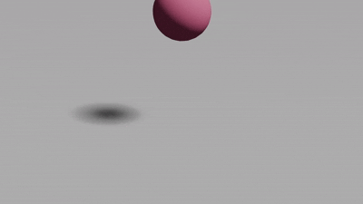

# energy_subspace_dynamic

这是一个使用 **Vulkan + Compute Shader** 实现的子空间有限元（Subspace FEM）仿真项目。  

## 项目定位

- 以 GPU 计算为核心，验证子空间方法在 Vulkan Compute 下的实现方式
- 采用子空间求解以降低计算维度，同时保留全空间信息的可映射性

## 设计思路

本项目虽然使用子空间变量进行求解，但整体实现是**从全空间问题出发组织**的：

- 全空间中定义网格、质量、四面体拓扑与物理量
- 子空间中进行降维求解与迭代
- 通过基底在全空间与子空间之间进行双向映射

这样做的好处是后续扩展更直接，例如：

- 增加新的力学项或约束
- 切换/对比不同求解策略
- 逐步回到更完整的全空间算法实现

## 当前实现特点

- Vulkan Compute Shader 负责主要物理计算
- 子空间求解主循环已打通
- 代码结构保留了向更复杂物理模型扩展的空间

## 仿真结果图

140k_tet球体实时模拟效果

## 说明

如果你只关心算法部分，可以直接看：

- `src/subspace_simulator.cpp`
- `src/vk_two_phase.cpp`
- `shaders/`
